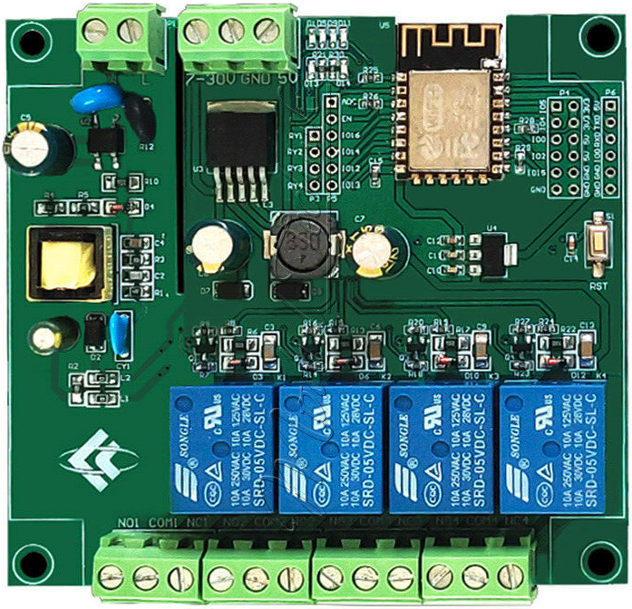
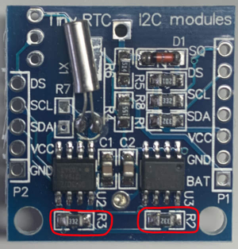
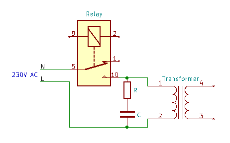
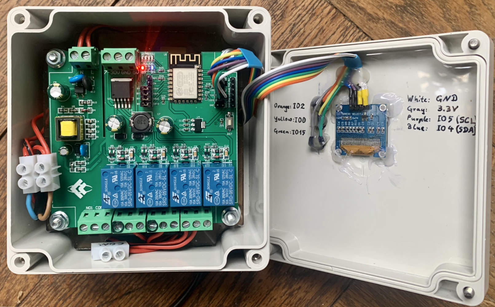
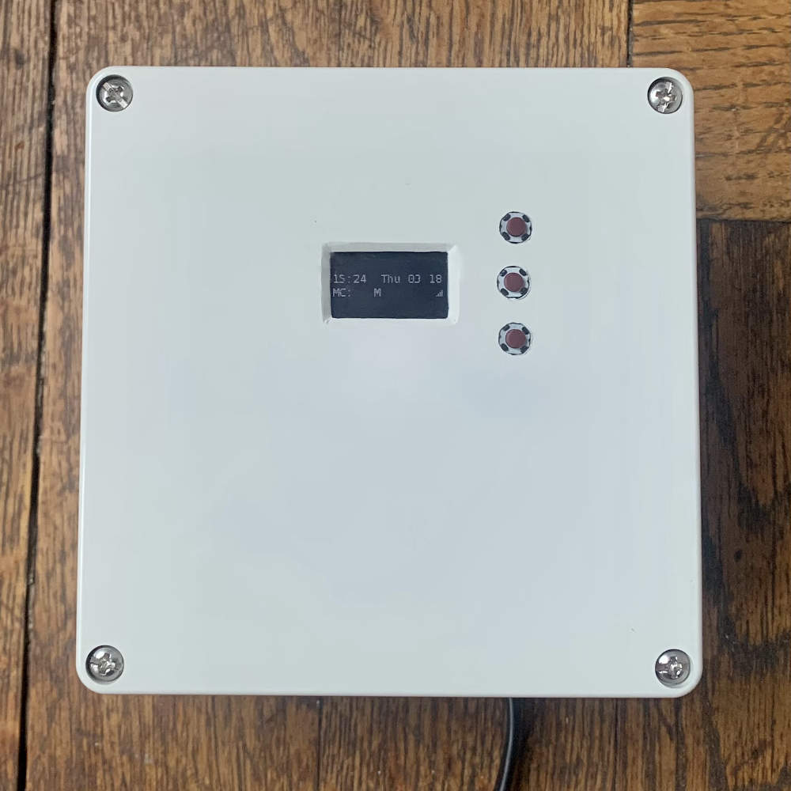
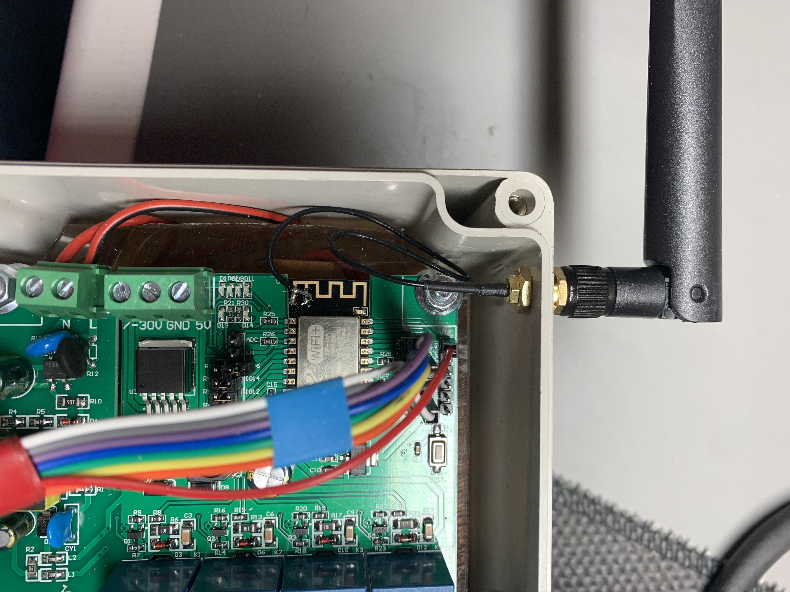

# OpenSprinkler-Firmware for 4 Channels Relay Boards with ESP-12F
> This Firmware is a slightly modified variant of the original OpenSprinkler firmware
> to run with an inexpensive 4 Channels Relay Module AC/DC ESP-12F Development Board (a.k.a. "ESP12F_Relay_X4")

**See also [ESP12F_Relay_X4_Schema.pdf](ESP12F_Relay_X4/ESP12F_Relay_X4_Schema.pdf)**

## Supported Features:
* 4 OpenSprinkler station, controlled by the board relays
* 3 Buttons
* OLED Display (SSD1306, 128x64)
## Known Restrictions
* Only 4 sprinkler stations are supported (no support for Zone Expander)
* Sensor 1 and 2 are not supported yet (GPIO1 and GPIO3 could be used)
* RF Transmitter not supported yet (GPIO10 could be used)
* Current sensing is not supported (disabled on the OLED display)

## Used Hardware
* [ESP12F_Relay_X4 board](https://www.ebay.com/sch/i.html?_nkw=4+Channels+Relay+Module+AC%2FDC+ESP-12F+Development+Board&_sacat=0&_sop=15)
  * Solder all supplied pin headers
  * Attach the relay jumper
    * `RY1` <—> `IO16`
    * `RY2` <—> `IO14`
    * `RY3` <—> `IO12`
    * `RY4` <—> `IO13`
* [128x64 OLED Display (SSD1306)](https://www.ebay.com/sch/i.html?&_nkw=128x64+OLED+Display+SSD1306&_sop=15)
  * Wiring: `Display` <—> `ESP12F_Relay_X4`:
    * `GND` <—> `GND`
    * `VCC` <—> `3.3V`
    * `SCL` <—> `IO5`
    * `SDA` <—> `IO4`
* [Real Time Clock (DS1307)](https://www.ebay.com/sch/i.html?_from=R40&_nkw=DS1307+I2C+RTC+Module&_sacat=0&_sop=15)  
Since this is a 5V module it's important to remove the pull up resistors (5V!) on SDA and SCL.  
  
It's also important to use a rechargeable battery LIR2332!
  * Wiring: `RTC` <—> `ESP12F_Relay_X4`:
    * `GND` <—> `GND`
    * `VCC` <—> `5V`
    * `SCL` <—> `IO5`
    * `SDA` <—> `IO4`
* [Push Buttons](https://www.conrad.com/p/diptronics-dtsm-66n-v-b-pushbutton-12-v-dc-005-a-1-x-offon-momentary-1-pcs-707570)
  * Wiring: `ESP12F_Relay_X4` <—> `Button` <—> `Powering`:
    * `IO2` <—> `Button 1` <—> `GND`
    * `IO0` <—> `Button 2` <—> `GND`  (IO0 has an external pull up resistor on the board!)
    * `IO15` <—> `Button 3` <—> `3.3V`  (IO15 has an external pull down resistor on the board!)

* [USB to TTL Serial Adapter 3.3V](https://www.amazon.com/dp/B089YTXK8V)
  * Assure that the Adapter is set to 3.3V (in case it supports also 5V)
  * Wiring: `TTL-Adapter` <—> `ESP12F_Relay_X4` _(only needed during programming)_:
    * `GND` <—> `GND`
    * `RXD` <—> `TXD`
    * `TXD` <—> `RXD`
    * `3.3V` <—> `3.3V`
* Valve Power Supply (e.g. [24V~Bell-Transformer](https://www.amazon.de/-/en/JCL-BT8-8-Brand-Bell-Transformer/dp/B00K1CWEUG), in case you use 24V AC valves.)  
  **Important:** If you want to turn on the transformer via a relay (as OpenSprinkler  Master Zone) you should consider to use a ["RC Circuit" aka "Snubber"](https://www.ebay.com/sch/i.html?_from=R40&_trksid=p2047675.m570.l1313&_nkw=Absorption+Snubber+Circuit&_sacat=0) to protect the relay contacts.  
  
* Enclosure (e.g. [TRU COMPONENTS TC-9065652 Universal enclosure](https://www.conrad.com/p/tru-components-tc-9065652-universal-enclosure-122-x-120-x-85-acrylonitrile-butadiene-styrene-grey-white-ral-7035-1-2266413), in case you want to place the transformator into the enclosure)

## Used Software
  * [Visual Studio Code](https://code.visualstudio.com/download)
  * [PlatformIO IDE Extension](https://platformio.org/install/ide?install=vscode)

## Building and flashing of the firmware
* In PlatformIO select the "esp12f_4ch_relay_board" task of the Project
* Build the firmware
* To activate the Flash-Mode Press and hold Button 2 until the reset button on the ESP12F_Relay_X4 board was also pressed
* Upload the Firmware
* Press the RST button of the ESP12F_Relay_X4 board
* Follow the instructions of the [OpenSprinkler User Manual](https://opensprinklershop.de/wp-content/uploads/2020/05/os-manual_2.1.9.pdf)

## Meta

Distributed under the GNU General Public License license. See [LICENSE.txt](LICENSE.txt) for more information.

[https://github.com/ThFischer/OpenSprinkler-Firmware/tree/ESP-12F-4CH-Relay-Board](https://github.com/ThFischer/OpenSprinkler-Firmware/tree/ESP-12F-4CH-Relay-Board)

## Update:
Since the WiFi connectitivity was quite poor I added an [external antenna](https://www.amazon.de/gp/product/B07SSYSZM9).
See https://www.instructables.com/External-Antenna-for-ESP8266/ for more details.

## Another variant …
I added [the branch "NODEMCU_74HC595" branch](https://github.com/ThFischer/OpenSprinkler-for-ESP12F_Relay_X4/tree/NODEMCU_74HC595/NodeMCU-74HC595#readme) that uses a NodeMCU, 74HC595 ShiftRegister and an 8Ch 5V Relay board.
