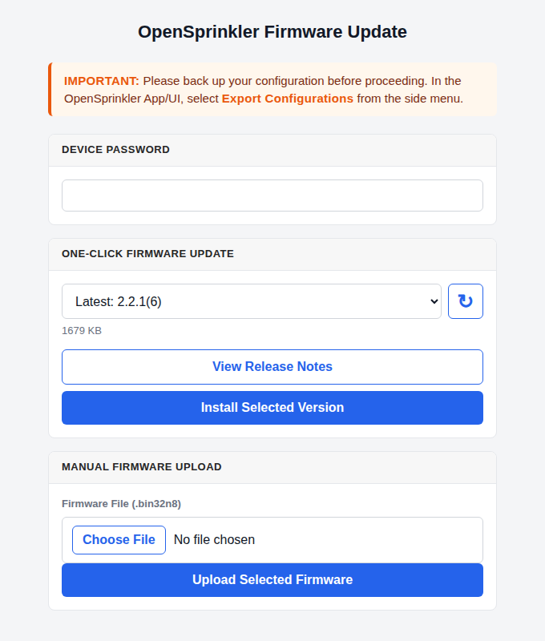

# Firmware Update

## OpenSprinkler v3 and v4 {: .hltitle}

!!! warning "Back Up Before Updating"
    Before updating, back up your configurations (Sidebar → **Export Configurations**) so you can quickly restore programs and settings if needed.

    * A **Dotted Version Update**, e.g. 2.2.0 to 2.2.1, triggers a factory reset and **erases all programs, settings, and logs**.
    * A **Build Number Update**, e.g. 2.2.1(4) to 2.2.1(6), normally preserves programs and settings. On OpenSprinkler v3, the 2.2.1(6) upgrade removes old sprinkler logs while migrating to the new bounded log format. If needed, download the old log records before firmware update.

---

### One-Click Firmware Update

One-click update is available starting with firmware 2.2.1(6). It automatically checks the official release catalog and installs a compatible firmware version without requiring you to download an image manually. Internet access is required for one-click update.

{: .center_wider .img-border}

1. Connect to the controller through its **local IP address**. One-click update is not available through OTC or while the controller is in WiFi AP mode.
2. At the homepage, open the side menu and choose **Update Firmware**; or navigate directly to `http://os-ip/update` (where `os-ip` is your controller's IP address).
3. Enter the controller's **Device Password**.
4. Select the desired version under **One-Click Firmware Update**. Use **View Release Notes** to review the changes before proceeding.
5. Tap **Install Selected Version** to proceed. Keep the controller powered and the browser open while the firmware is updating. The controller reboots automatically when finished.

A controller running firmware older than 2.2.1(6) must first install a current compatible release through **Manual Firmware Upload**. It can then use one-click update for future releases.

---

### Manual Upload

If one-click update is unavailable or does not work, use the **Manual Firmware Upload** panel shown near the bottom of the screenshot above:

1. Download the latest compatible image from the OpenSprinkler Compiled Firmware Archive. The latest release is currently firmware 2.2.1(6):
    * [OpenSprinkler v3 (ESP8266)](https://raysfiles.com/os_compiled_firmware/v3.x/) uses a `.bin` file.
    * [OpenSprinkler v4 (ESP32-C6-N8)](https://raysfiles.com/os_compiled_firmware/v4.0/) uses a `.bin32n8` file.
2. Under **Manual Firmware Upload**, choose the downloaded file, enter the controller's Device Password, and tap **Upload Selected Firmware**.
3. Keep the controller powered and the browser open until the installation finishes and the controller reboots.

Do not install a v3 image on v4, or a v4 image on v3.

---

### Alternative Methods

**WiFi AP mode:** If your controller is currently in WiFi AP mode, connect your computer or phone to the AP SSID shown on the controller's LCD, then open `http://192.168.4.1/update` in a browser.

---

### Troubleshooting

* **Blank Homepage:** If the device homepage is blank or showing an error, and you need to export configuration before updating, see [Blank Page Troubleshooting](troubleshooting.md#ui-app-time-and-lcd).
* **No Available Firmware:** Use Manual Upload if your browser cannot reach the firmware release site, or if the controller's firmware predates one-click update support.
* **Upload Connection Failure:** Make sure port `8080` is not blocked by your computer, router, or firewall, then retry the upload.
* **Controller Stops Responding:** Allow several minutes for installation and reboot. If the controller remains unreachable, unplug and reconnect power, then retry the update.
* **Update via Wired Ethernet:** If your controller is connected via wired Ethernet:
    * If it runs firmware `2.2.0` or newer, follow the same steps as WiFi.
    * If it runs `2.1.9` or earlier, update must be done in WiFi mode:
        1. Power off the controller.
        2. Remove the Ethernet module.
        3. Power on - it will boot into WiFi AP mode.
        4. Follow the AP-mode update instructions above.
* **AP Mode Password Issues on Legacy Firmware:** Some older AP-mode update pages do not hash the password before submitting it. If your plaintext password fails, try its **MD5 hash** instead (e.g. the MD5 hash of `opendoor` is `a6d82bced638de3def1e9bbb4983225c`).
* **Firmware Corruption / Device Not Booting:**
    * **OpenSprinkler v3:** Re-flash the controller using a [USB-Serial Programmer](https://opensprinkler.com/product/usb-programmer/).
    * **OpenSprinkler v4:** Connect its built-in USB-C port directly to a computer. Its built-in USB CDC interface supports firmware recovery without an external USB-Serial Programmer. The same USB connection can provide serial diagnostic messages for firmware debugging.

    Contact [Support](https://support.opensprinkler.com) if you need instructions on firmware recovery or USB-based flashing.

## OpenSprinkler v2.3 {: .hltitle}

Requires a USB cable for firmware update. Follow the legacy [v2.3 Firmware Update Instructions](https://openthings.freshdesk.com/a/solutions/articles/5000832311).

## OpenSprinkler Pi (OSPi) {: .hltitle}

Update is done directly on the RPi. Follow [OSPi Firmware Update Instructions](https://openthings.freshdesk.com/a/solutions/articles/5000631599).

