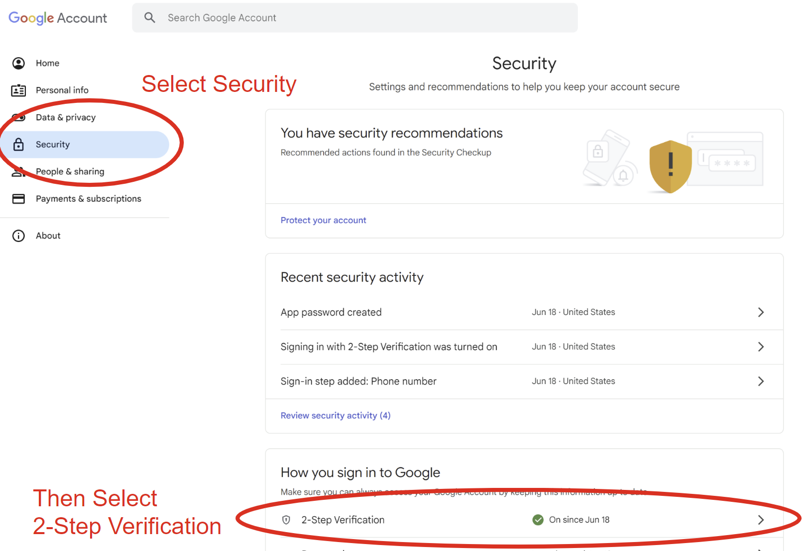
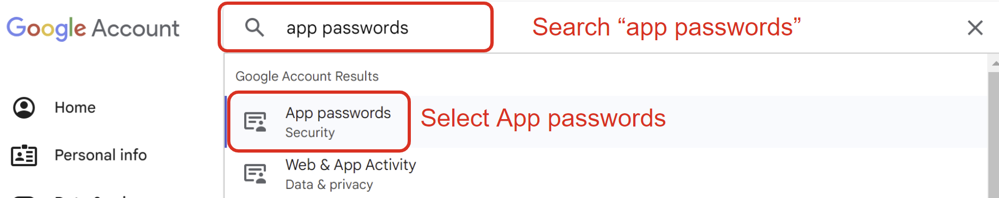
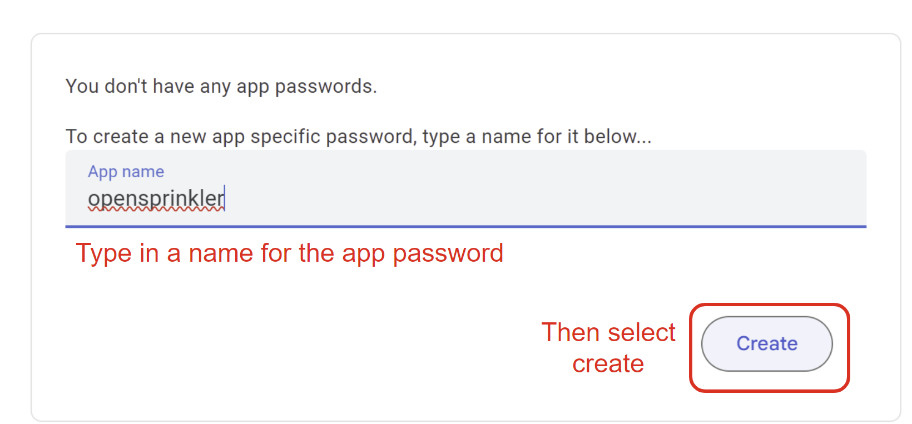
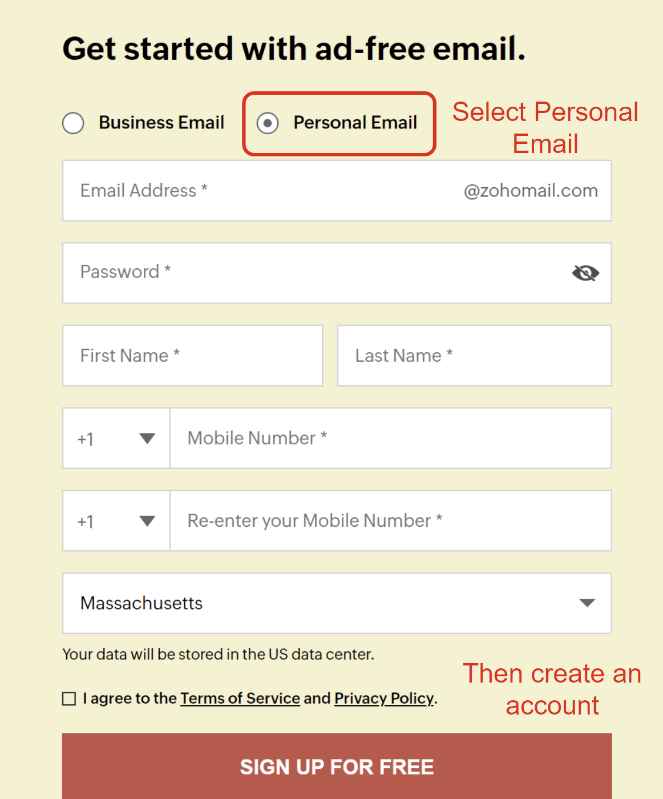
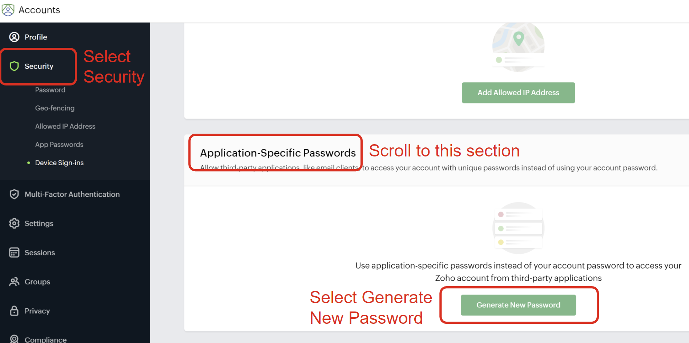
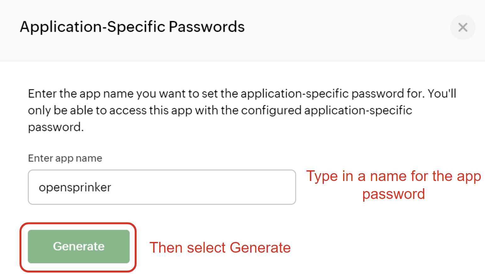
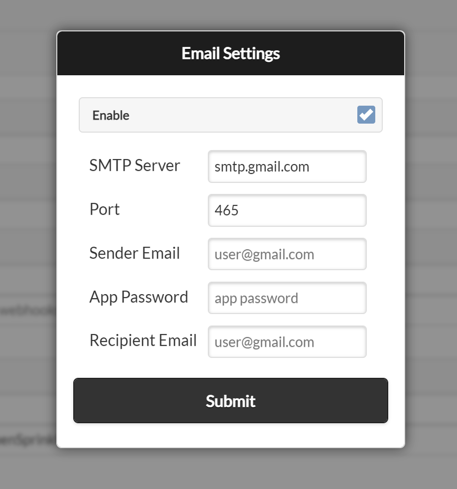

# Setting Up Email Notifications

Starting from **firmware 2.2.1** OpenSprinkler supports **email** notifications, offering a **free** alternative to IFTTT Webhooks (which now require a paid subscription).

**Requirements**:

* Minimum Firmware Version: **2.2.1**
* Minimum App/UI Version: **2.4.1**

!!! note
    This guide also applies to **OpenGarage firmware 1.2.3** and later, which also supports email notifications.

## How Email Notifications Work and Best Practices

OpenSprinkler sends email notifications using a user-selected **SMTP** (Simple Mail Transfer Protocol) server, such as [Gmail](http://www.gmail.com) or [Zoho](https://www.zoho.com/mail).

* When a notification event occurs, the firmware establishes an SSL connection (via port 465) to the SMTP server.
* The notification message is then sent automatically via email.
* Gmail and Zoho SMTP servers have been verified to work with OpenSprinkler. Other SMTP services **may not** work if they require newer TLS encryption instead of SSL.

To enable email notifications, provide the following SMTP settings:

| **Parameter** | **Description** |
| ------------- | --------------- |
| **SMTP Server** | e.g. `smtp.gmail.com` or `smtp.zoho.com` |
| **Port** | `465` (SSL connection) |
| **Sender Email** | The sender (i.e. **"From"**) email address (must be a valid email account). |
| **App Password** | An **application-specific password** generated by your email provider (**NOT** your normal email login password). |
| **Recipient Email** | The receiver (i.e. **"To"**) email address (where notifications will be received. It does not have to be identical to the sender email) |

 

* The **Sender Email + App Password** act as login credentials for the SMTP server.
* The **Recipient Email** can be any email address, and does NOT have to be Gmail or Zoho.

Most SMTP services **limit** the number of emails that can be sent per day. As of this writing:

* **Gmail**: **500** emails/day
* **Zoho**: **50** emails/day

Exceeding this limit may result in a **temporary suspension of the sender email** account. We recommend:

* Create a **dedicated sender email & app password just for notifications**.
* Use a **different recipient email** to receive alerts.

By following these steps, you can set up email notifications without affecting your primary email accounts.

## Step 1: Create a Sender Email Account and App Password

### Option 1: Using Gmail SMTP (Recommended for higher daily limits)

* Navigate to [this page](https://www.google.com/intl/en-US/gmail/about/) to create a new personal Gmail account. Even if you already have an existing Gmail it's recommended to create a new one dedicated for sending notifications.
* After creating this account, navigate to [myaccount.google.com](https://myaccount.google.com). Once there, select the **Security** tab and scroll down to **2-Step Verification**. Google will not let you create an app password without this enabled. See screenshot below.

* Follow the steps to activate 2-Step verification, then go back to [myaccount.google.com](https://myaccount.google.com) and enter **app passwords** into the search bar at the top. Select **App Passwords** in the search result.

* On the app passwords screen, enter an App name (e.g. **opensprinkler**) and press **Create**.

* A popup window will show a 16 character password in the format `"xxxx xxxx xxxx xxxx"`. Please save this app password securely, as it's required by the email configuration and this is the **only time it's visible to you**. Once the popup window is closed, you will not see the app password again. However, you can always create a new app password if you've lost the old one.

### Option 2: Using Zoho SMTP (Alternative to Gmail)

* If you prefer a non-Gmail account, Zoho mail is a good alternative. Begin by navigating to [this site](https://www.zoho.com/mail/?ireft=nhome&src=fa) to create a new Zoho Mail **personal account**. Make sure to select "**Personal Email**" (NOT the default "Business Email").

* Once you have created your account and logged in, navigate to [accounts.zoho.com](https://accounts.zoho.com). Then select the **Security** tab and scroll to the section labeled "**Application-Specific Passwords**" and click the button "**Generate New Password**".

* A window will pop up to create a new app password. Here you can enter the **app name** (it can be anything, such as **opensprinkler**) and click **Generate**. Please save this app password securely, as it's required by the email configuration and this is the **only time it's visible to you**. Once the popup window is closed, you will not see the app password again. However, you can create a new app password if you've lost the old one.

!!! note
    In some cases you may get a popup asking you to verify your password. If so, follow that popup and enter your password when prompted. You will then be returned to the app password pop up and you can click **Generate** again.

## Step 2: Configure Email Settings

On your OpenSprinkler's homepage, navigate to **Edit Options --> Integrations**. Then click "**Tap To Configure**" next to **Email Notifications**. Enter the required parameters (see below), and click **Submit**.

| **Parameter** | **Value** |
| ------------- | --------- |
| **SMTP Server** | `smtp.gmail.com` (for Gmail) or `smtp.zoho.com` (for Zoho Mail) |
| **Port** | `465` |
| **Sender Email** | The email address created in Step 1 |
| **App Password** | The **16-character App Password** generated in Step 1 |
| **Recipient Email** | Any of your existing email addresses. It can be the same as the sender email but does not have to be. |

 

## Step 3: Choose Notification Events and Set Device Name

The final step is to choose **which events will trigger email notifications** and configure a custom **Device Name** for easy identification. Go to **Edit Options --> Integrations**, click **Notification Events**, and you will see a list of choices:

* **Program Start**: Triggered when a program starts.
* **Sensor 1 Update**: Triggered when Sensor 1 is enabled and its status changes.
* **Sensor 2 Update**: The same as above but for sensor 2.
* **Rain Delay Update**: Triggered when the rain delay status changes.
* **Flow Sensor Update**: Triggered upon the completition of a program if the flow sensor is enabled.
* **Weather Update**: Triggered when there is weather update (e.g. a change in water level) or when the external IP address changes.
* **Controller Reboot**: Triggered when the controller restarts.
* **Station Finish**: Triggered when a station (zone) completes its run.
!!! note
    This may generate a high number of notifications. Only enable it if necessary.
* **Station Start**: Triggered when a zone begins running.
!!! note
    This may generate a high number of notifications. Only enable it if necessary.
* **Flow Alert**: Triggered when a zone finishes running and the flow rate exceeds the set threshold.
* **Current Alert**: Triggered when undercurrent or overcurrent faults are detected. (Available from firmware 2.2.1(3))

!!! warning
    If your controller runs many zomes daily, consider disabling certain events (e.g. **Station Start** and **Station Finish**) to prevent excessive email notifications and avoid exceeding your email provider's daily spending limit. Since sending each notification takes time, **too many notification events can cause delays, missed reponses, and skipped short watering cycles**.

Below **Notification Events** you can enter a custom **Device Name**. This Device Name is included in all email messages, making it easier to identify which controller sent the message. This is especially helpful if you manage multiple OpenSprinkler devices.

### Important Notes

* **Notification events apply to MQTT, email, and IFTTT notifications**. If you make changes to the Notification Events selection, keep in mind the changes apply to all three methods if enabled.
* Multiple OpenSprinkler devices can **share the same email settings**, as long as the total number of emails sent remains below the daily limit.
    * If needed, create separate sender email accounts for each OpenSprinkler device while keeping the same recipient email for all.
