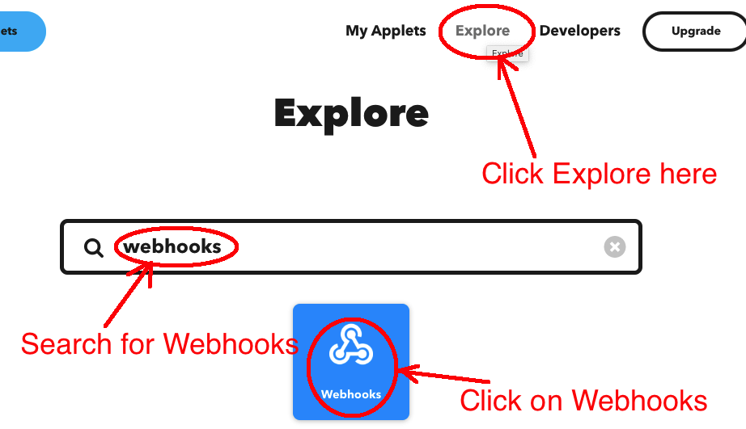
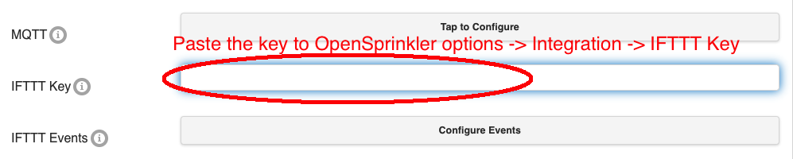
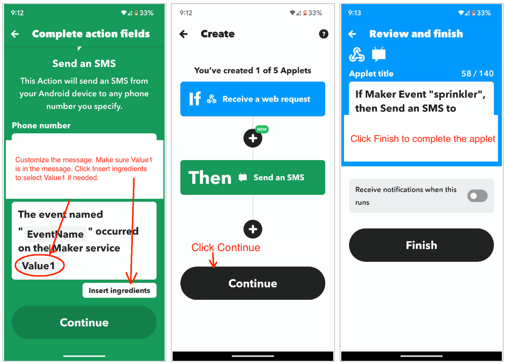

# Setting Up IFTTT Notifications

OpenSprinkler can send notification events to [IFTTT](https://ifttt.com/) through the IFTTT Webhooks service. An IFTTT Applet can then forward those events as push notifications, email, SMS, or any other action supported by IFTTT.

!!! note "IFTTT subscription"
    IFTTT currently requires a [paid plan for Applets that use the Webhooks service](https://help.ifttt.com/hc/en-us/articles/115010230347-Webhooks-service-FAQ). For a no-subscription alternative, use [email notifications](email-notifications.md).

---

## Step 1: Create an IFTTT Account and Obtain a Webhooks Key

1. Sign in to the [IFTTT website](https://ifttt.com/) or mobile app, or create an account.
2. Open **Explore**, search for **Webhooks**, and select the Webhooks service.

    { .img-border .img-center .guide-screenshot width="600" }

    { .img-border .img-center .guide-screenshot width="500" }

3. If prompted, connect the Webhooks service. In its **About Webhooks** section, select **Documentation**.

    { .img-border .img-center .guide-screenshot width="550" }

4. Copy the Webhooks key shown on the documentation page. Treat this key as a password and do not publish it.

    { .img-border .img-center .guide-screenshot width="650" }

If the key stops working, regenerate it in the IFTTT Webhooks settings and update the key in OpenSprinkler.

---

## Step 2: Create an IFTTT Applet

An IFTTT Applet connects a trigger (**If This**) to an action (**Then That**). OpenSprinkler supplies the trigger through Webhooks.

1. Select **Create** in IFTTT.
2. For **If This**, select **Webhooks**, then choose **Receive a web request**.

    { .img-border .img-center .guide-screenshot width="650" }

3. Enter `sprinkler` as the **Event Name**, then select **Create trigger**. This name is fixed by the OpenSprinkler firmware and is case-sensitive.

    { .img-border .img-center .guide-screenshot width="650" }

4. For **Then That**, choose the desired action, such as a push notification, email, or SMS.
5. In the action's message field, insert the **Value1** ingredient. OpenSprinkler places the complete notification message in `Value1`.

    { .img-border .img-center .guide-screenshot width="650" }

6. Save and enable the Applet.

---

## Step 3: Configure OpenSprinkler

On the OpenSprinkler homepage, go to **Edit Options** → **Integration**:

1. Enter the Webhooks key in **IFTTT Notifications**.
2. Open **Notification Events** and select the events that should trigger notifications.
3. Enter a descriptive **Device Name**. It is included in IFTTT and email notification messages and helps you tell multiple controllers apart.
4. Submit the changes.

The selected Notification Events are shared by IFTTT, email, and MQTT. An event is sent through every configured notification method that supports it.

!!! warning
    Avoid enabling more events than you need, especially **Station Start** and **Station Finish** on controllers that run many stations. Sending each remote notification takes time; excessive notifications can cause delays, slow web/app responses, or skipped short watering cycles. SMS carriers may also filter frequent messages.

For Bundle Station runs, only the bundle leader generates Station Start and Station Finish notifications. Other stations in the bundle do not generate separate notifications.

---

## Troubleshooting

* Confirm that the Applet uses the exact event name `sprinkler`.
* Confirm that the action includes the **Value1** ingredient.
* Verify that the Webhooks key in OpenSprinkler matches the current key shown by IFTTT.
* Confirm that at least one Notification Event is selected.
* Confirm that the controller has internet access.
* Use the IFTTT activity log to determine whether the Webhooks trigger ran and whether the selected action succeeded.
