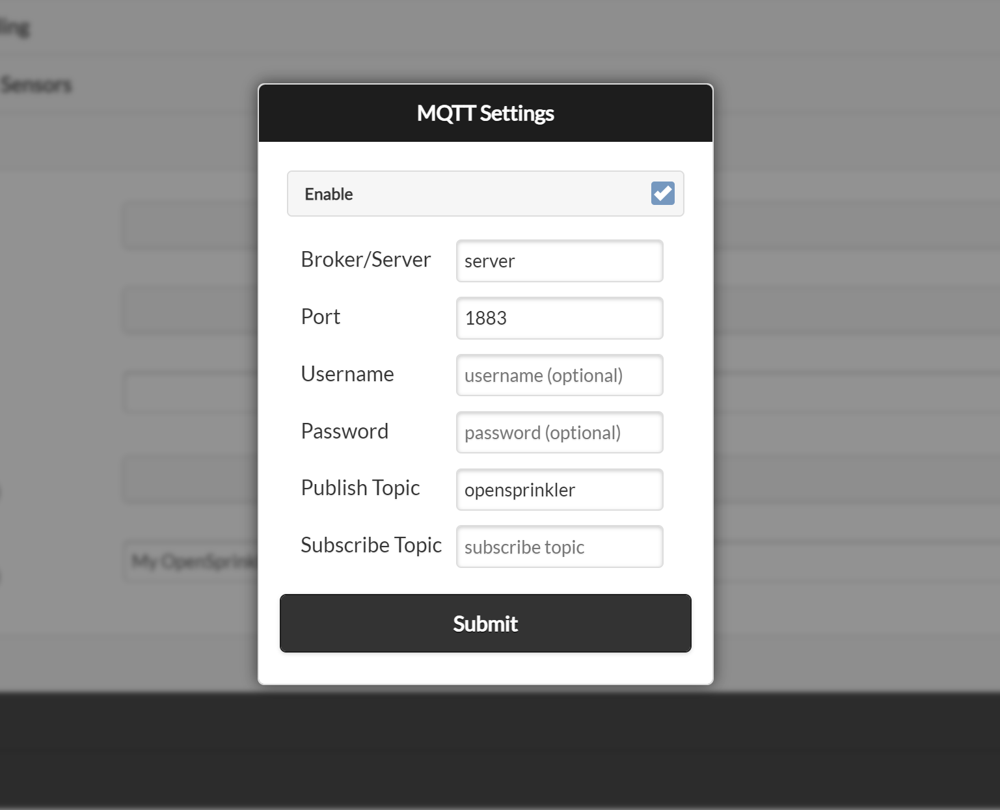

# How to Use MQTT

## Introduction

Starting from firmware **2.2.1**, the MQTT feature has been expanded to include **subscription support** and **customization of topics**.

**Key Features**:

* **Publish**: As before, the controller can publish its status and information to an MQTT broker. An MQTT client can then subscribe to these topics to receive real-time updates.
* **Subscribe (New in 2.2.1)**: The controller can now **subscribe** to an MQTT broker, allowing it to receive and act upon specific **commands from an MQTT client**. This enables actions such as:
    * Manually starting a zone
    * Running a program
    * Rebooting the controller

  To use these features, ensure your system meets the **minimum requirements**:

  * **Firmware Version: 2.2.1** or later
  * **App/UI Version: 2.4.1** or later

---

## MQTT Configurations

To configure MQTT settings in OpenSprinkler, navigate from the homepage to **Edit Options** → **Integration**. Here you can adjust the MQTT settings:

{ .img-border .img-center }

* **Broker/Server**: Enter either the **IP address** or **DNS name** of your MQTT broker/server.
* **Port**: The default MQTT broker port is 1883. Modify this if your broker uses a different port.
* **Username/Password (Optional)**: Provide credentials if your broker requires authentication.
* **Publish Topic**: The topic where OpenSprinkler publishes notifications.
    * Default: **opensprinkler** (for backward compatibility)
    * Recommended: Change this to a unique name to distinguish between multiple controllers.
* **Subscribe Topic**: The topic OpenSprinkler listens to for commands. It is initially empty, which disables command subscription. Click **Use Default** to generate a unique topic based on the controller's MAC address, or enter another topic that is unique to this controller.

---

## Understanding MQTT Broker and Client

If you're new to MQTT, you may want to look up MQTT tutorials or guides for a deeper understanding.

* In **Linux or Raspberry Pi**, you can set up an MQTT broker using **Mosquitto**:

```bash
sudo apt install mosquitto mosquitto-clients
```

* MQTT follows a **publisher/subscriber model**:
    * The MQTT **broker** manages multiple publishers and subscribers.
    * A **publisher** sends messages to the **MQTT broker**.
    * A **subscriber** receives messages from the **MQTT broker**.
* You can use these **command-line tools**:
  * **Publish a message**:

```bash
mosquitto_pub -h <broker_ip> -t "my_topic" -m "message_content"
```

  * **Subscribe to a topic**:

```bash
mosquitto_sub -h <broker_ip> -t "my_topic"
```

* Mobile apps are also available for **publishing and subscribing** to MQTT topics.

---

## Understanding MQTT Topics

MQTT data is structured in a **hierarchy of topics** separated by "/".

### Example: Publishing Data from OpenSprinkler

* The OpenSprinkler firmware can **publish** status data to:
  `my_opensprinkler/station/0`
    * Contains **status information** for **station 0** (first station) of the **my_opensprinkler** controller.
* Or **send a sensor event** to:
  `my_opensprinkler/sensor1`
    * Contains data for **sensor1** of that controller.

### Subscribing to Topics

* A subscriber can:
    * Listen to a **specific topic**:
    `my_opensprinkler/station/0`
    * Use **wildcards** to subscribe to **multiple topics**:
        * Receive **all** topics under **my_opensprinkler/**:
      `my_opensprinkler/#`
        * Receive **ALL** topics from **ALL** controllers:
      `#`

With these configurations, OpenSprinkler can effectively **integrate with MQTT** enabling seamless automation and real-time updates.

---

## Topics Published by Firmware 2.2.1(6)

OpenSprinkler publishes messages to the MQTT broker in a format similar to IFTTT and email notifications.

* The **default root topic** is `opensprinkler`, but can be customized in the settings.
* The publish topic itself can contain subtopics, such as `MA_home/lawn/sprinkler`.
* Due to the firmware storage limit, the **maximum topic length is 24 characters**.
* Below we use `publish_topic` to denote this name.

Here is the list of topics that firmware 2.2.1(6) publishes:

* **Reboot**: `publish_topic/system` sends `{"state":"started","cause":cc}` when the controller boots, where `cc` is the [reboot-cause code](../api.md#reboot-cause-codes).
* **Program Start**: `publish_topic/program/x`, where `x` is the program index (starting from 0 for the first program).
    * A successfully scheduled program sends `{"state":1,"wl":xx,"wa":w,"sa":s,"ta":t}`. `wl` is the weather-adjusted watering percentage; `wa`, `sa`, and `ta` are the weather, sensor, and total adjustment factors.
    * A skipped program sends `{"state":"skipped","wtrestr":x}`. The program may be skipped because its watering level is 0% or because of the weather restriction indicated by `wtrestr`.
* **Zone Activity**: `publish_topic/station/x`, where `x` is the index (starting from 0 for the first zone).
    * This topic sends `{"state":1,"duration":ss}` when zone `x` starts, where `ss` is the scheduled runtime in seconds.
    * It sends `{"state":0,"duration":rs}` when that zone closes, where `rs` is the actual runtime in seconds. When SN1 is configured as a flow sensor, the closing payload also includes `"flow":ff` for a completed run.
    * To receive messages for all zones, subscribe to wildcard `publish_topic/station/#`. Firmware 2.2.1 also publishes `{"state":1}` on a **master/pump** zone when that zone opens, but the duration is omitted as a master zone runs dynamically based on other zones.
    * For a Bundle Station run, only the bundle leader publishes zone activity; its derived bundle members do not publish separate activity messages.
* **Sensor Events**: `publish_topic/sensorN` sends `{"state":1}` when built-in sensor `N` activates and `{"state":0}` when it deactivates. `N` ranges from 1 to 4 where supported by the controller hardware.
* **Rain Delay Events**: `publish_topic/raindelay` is similar to sensor events but for rain delays.
* **Flow Sensor Data**: `publish_topic/sensor/flow` sends `{"count":cc,"volume":vv}` when the flow sensor generates data, normally after a program finishes. `cc` is the pulse count and `vv` is the calculated volume in the unit implied by the configured **Flow Pulse Rate**.
* **Weather Adjustment Updates**: `publish_topic/weather` sends `{"water level":pp}` when the watering percentage changes, such as after an automatic weather update.
* **Flow Alert**: `publish_topic/station/x/alert/flow` sends `{"flow_rate":ff,"duration":ss,"alert_setpoint":aa}` when zone `x` exceeds its configured flow-alert setpoint.
* **Current Alert**:
    * **Station Under or Overcurrent Alert**: `publish_topic/station/x/alert/curr`, where `x` is the station index. This topic sends `{"curr_value":cc,"imin_threshold":tt}` or `{"curr_value":cc,"imax_limit":tt}` for under and overcurrent alerts respectively.
    * **System Overcurrent Alert**: `publish_topic/overcurrent` sends `{"curr_value":cc,"imax_limit":tt}`.
  !!! note
      Station overcurrent is detected immediately after a station is turned on (so the firmware can detect the offending station). System overcurrent is detected during the operation of the system, not associated with opening a zone.

!!! note "Notification events and availability"
    Starting **from 2.2.1(1)**, MQTT notifications are managed through the **Notification Events** setting, just like IFTTT and email notifications. To receive event messages, you must **enable the corresponding Notification Events**. If no events are selected, the controller still publishes its availability state but does not publish event notifications.

    OpenSprinkler publishes `publish_topic/availability` with the retained payload `online` or `offline` (i.e. non-JSON). If your MQTT client requires strict JSON format (such as [ThingsBoard](https://thingsboard.io/)), configure your client to filter out non-JSON payloads or set up an Uplink Data Converter.

---

## Topics Subscribed by Firmware 2.2.1

Firmware **2.2.1** allows OpenSprinkler to **subscribe** to a user-defined **MQTT topic**, enabling it to receive commands from an MQTT broker. This means an **MQTT client** can send commands to control OpenSprinkler's operations.

To enable this feature:

* Set a valid **Subscribe Topic** in the **MQTT configuration** above. Click **Use Default** to generate one from the controller's **MAC address** (e.g. `OS-112233AABBCC`).
* You may enter a custom topic, but each controller should have a **unique subscribe topic**.
* Due to firmware storage limitations, the **maximum length** of a subscribe topic is **24 characters**.
* The **Subscribe Topic is optional**. If left empty, the controller will **not respond to MQTT commands**.

To control OpenSprinkler, an **MQTT client** must:

1. **Publish a command message** to the `subscribe_topic`.
2. **Include a payload** that specifies the command and parameters.

The commands must **follow the same format** as OpenSprinkler's **HTTP API** (see the [HTTP API reference](../api.md)). Specifically:

* Payload structure:
  `<endpoint>?<parameter1>=<value>&<parameter2>=<value>`
* The **endpoint** is a **two-letter code** (without a leading "/") as in the HTTP API.
* Parameters are **separated by &**.
* The **device password (`pw`)** must be included as its lowercase **MD5 hash**, unless **Ignore Password** is enabled.

MQTT commands are fire-and-forget. The controller does not publish an acknowledgement or error response, so an invalid or rejected command produces no MQTT reply.

Only a subset of the HTTP API commands are currently supported. Their validation and behavior match the corresponding HTTP endpoints:

* **Change Controller Variables** (endpoint: `cv`) with the following parameters:
    * `rsn`: Reset all stations (include those waiting to run).
    * `rbt`: Reboot controller.
    * `en`: Operation enable/disable.
    * `rd`: Set rain delay time (in hours).
* **Manual Station Run** (endpoint: `cm`)
* **Manually Start a Program** (endpoint: `mp`)
* **Start Run-Once Program** (endpoint: `cr`)

For example, to reset all stations, the payload message would be `cv?pw=xxx&rsn=1`, where `pw=xxx` is the lowercase MD5 hash of the device password.

To use **mosquitto_pub** to send this command, you may run:

```bash
mosquitto_pub -h your_mqtt_broker -p 1883 -t subscribe_topic -m "cv?pw=xxx&rsn=1"
```

As another example, to manually start zone 1 for 2 minutes and 45 seconds (i.e. a total of 165 seconds), the payload message would be:
`cm?pw=xxx&sid=0&t=165&en=1`

Refer to [MQTT Command Subscriptions](../api.md#mqtt-command-subscriptions) in the HTTP API reference for the complete command parameters and behavior.

!!! note "MQTT packet-size limit"
    On OpenSprinkler v3 and v4, the MQTT library limits each complete packet to 256 bytes. The topic and MQTT protocol overhead count toward this limit, so the available command payload is less than 256 bytes and depends on the topic length. Oversized commands are silently discarded before the firmware receives them; this most often affects `cr` commands containing durations for many stations. OSPi/Linux does not have this firmware-defined limit. Use the HTTP API for commands that do not fit in one MQTT packet.
