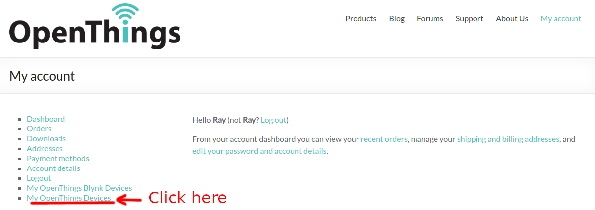
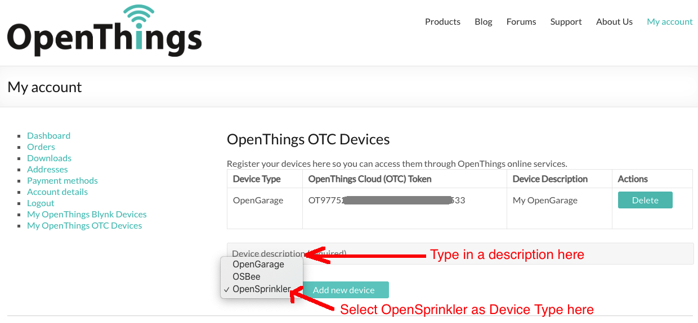
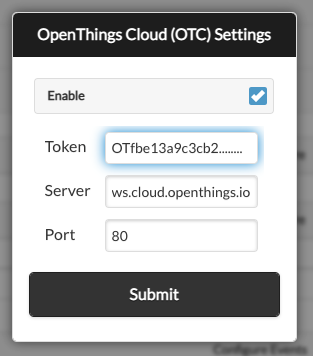
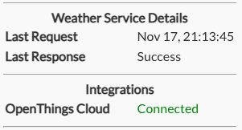
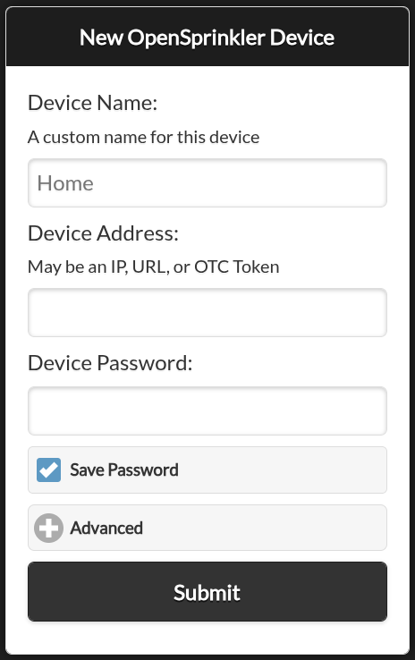

# Remote Access with OpenThings Cloud (OTC)

OpenThings Cloud (OTC) provides remote access to OpenSprinkler without router port forwarding. The controller maintains an outbound connection to a public OTC server, and the OpenSprinkler App uses an OTC token to reach it from outside the local network.

OTC is supported on OpenSprinkler v3, v4, OpenSprinkler Pi, and Linux.

!!! warning
    Treat an OTC token as a credential. Anyone who has both the token and the device password may access the controller. Keep it private.

## Create an OTC Token

1. If you don't yet have an account, go to [opensprinkler.com](https://www.opensprinkler.com) and click **My Account** at the top to register.
2. Navigate to [openthings.io](https://www.openthings.io) and sign in using your opensprinkler.com account. The two websites use the same account credentials.
3. Select **My OpenThings Devices**. *Do **not** select **My OpenThings Blynk Devices**.*

    { .img-border .img-center }

4. Enter a **Description** for the controller and select **OpenSprinkler** as the device type.
5. Select **Add New Device**.
6. **Copy** the generated 32-character OTC token.

    { .img-border .img-center }

---

## Configure OpenSprinkler

1. Open the homepage of your OpenSprinkler controller. Go to **Edit Options** → **Integration**.
2. **Enable** OTC and paste the 32-character token into the OTC Token field.
3. Leave the default server and port unchanged unless you host your own OTC server.
4. **Submit** the changes and **reboot** the controller.

    { .img-border .img-center width="300" }

After the controller reboots, open **System Diagnostics** from the sidebar to verify the OTC connection:

* **Connected**: The controller is connected successfully.
* **Connecting...**: Wait up to a minute and check again.
* **Not enabled**: OTC is disabled or its settings were not saved.
* **Disconnected**: Check the controller's Internet connection, token, and firewall settings.

{ .img-border .img-center width="300" }

---

## Add the Remote Site

In the OpenSprinkler App, select **Add a New Site** or **Manually Add Device**. Enter a name and paste the 32-character OTC token as the **Device Address**.

{ .img-border .img-center width="300" }

The OTC site works both locally and remotely. You may still keep a separate site that uses the controller's local IP address for direct local access and firmware updates.

Instead of installing an app, you may access your controller using the hosted web App at [ui.opensprinkler.com](https://ui.opensprinkler.com) and the controller's OTC token.

---

## Direct Browser Access

You can remotely access your controller directly in a browser using:

```text
https://cloud.openthings.io/forward/v1/YOUR_OTC_TOKEN
```

Replace `YOUR_OTC_TOKEN` with the 32-character token. Avoid sharing screenshots, bookmarks, or browser history containing this address.

---

## Limitations

OTC is intended for remote access and normal API operations. Firmware updates still require a direct local-network connection and are not available through OTC.
