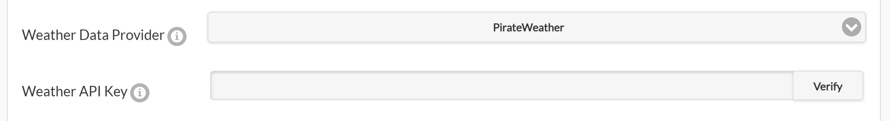

# Using Weather Adjustments

## Overview

OpenSprinkler can use online weather data to adjust scheduled watering times automatically. By default, it uses [Apple WeatherKit](https://developer.apple.com/weatherkit/) as the weather data provider, offering global coverage. This guide describes the available weather adjustment methods and their implementation details.

---

## Configuration

On the controller's homepage, go to **Edit Options** → **Weather Adjustment**, where you can select an **Adjustment Method**, set **Weather Restrictions**, and choose a **Weather Data Provider**. Each adjustment method has parameters that determine how the watering percentage is calculated.

{ .img-border .img-center }

### Selecting an Adjustment Method

* **Manual Adjustment (Default)**
    * Allows manual setting of the watering percentage (0–250%).
    * Programs with **Use Weather Adjustment** enabled scale their watering times by the selected percentage.
        * Example: If a program schedules 60 minutes for a zone and the watering percentage is set to 50%, the zone will water for 30 minutes.

* **Zimmerman**
    * Automatically adjusts the watering percentage based on the previous day's **average temperature**, **average humidity**, and **total precipitation**.
    * When selected, the **% Watering** input is disabled because the percentage is calculated dynamically.
    * It is a straightforward method suitable for general home irrigation.
    * Implementation details of the Zimmerman method and its parameters are explained below.

* **Auto Rain Delay**
    * Uses the current precipitation data to automatically set a rain delay.
    * **Does not modify the watering percentage.** It only triggers a rain delay when weather data indicates rain.

* **ETo (Evapotranspiration)**
    * A more **advanced** method based on industry standards.
    * Uses additional parameters, including the location's **coordinates**, **elevation**, **solar radiation**, and **yearly baseline ETo value**.
    * **Requirements**:
        * You must provide a **Baseline ETo** or click **Detect Baseline ETo** to determine it from your location.
        * You must set your **Elevation** for accurate calculations.
        * Implementation details about ETo and its parameters are explained below.

* **Monthly Adjustment**
    * Similar to Manual mode, but allows setting a **fixed watering percentage for each month**.
    * Useful for **seasonal watering schedules**.

---

### Using Multi-Day Average Watering Levels

Starting with **firmware 2.2.1(3)**, multi-day average watering levels can be used to adjust a program's run time. When the selected adjustment method is **Zimmerman** or **ETo**, a checkbox appears that enables this option for interval programs (programs that run on a fixed interval). For example, a program scheduled every 5 days will use the average watering levels from the past 5 days, rather than relying solely on yesterday's value. This provides more accurate adjustments for programs that do not run daily, accounting for all weather changes since the previous run.

This feature applies **only to interval programs** and does not affect other program types. When enabled, the array of multi-day watering levels is shown in System Diagnostics. The array length depends on the selected weather provider. Apple supports up to 10 days, while other providers may supply fewer days. Refer to each provider's historical weather-data capability in the table below.

---

### Weather Restrictions

Starting with **firmware 2.2.1(3)**, the following weather restrictions can be enabled with any adjustment method:

* **Rain**: Skip watering if the **total forecast rain** exceeds a set amount over a user-defined number of days (e.g., 0.5 inches over the next 3 days). Setting either value to 0 disables this rule.

    !!! note
        Forecast capability is limited by the selected weather provider. If the chosen number of days exceeds the available forecast, the maximum available number of days is used. See the table below for each provider's forecast capability.

* **Temperature**: Skip watering if the current temperature falls below a set value (e.g., 50&deg;F or 10&deg;C). A value of -40 (either &deg;F or &deg;C) disables this rule.
* **California Rule**: Legacy option that prevents watering if rainfall in the past 48 hours exceeds 0.1 inches.

If any weather restriction is active, it is displayed both on the homepage and in System Diagnostics.

---

### When Weather Data Is Unavailable

During normal operation, OpenSprinkler uses the last successful weather response for up to 24 hours. If no fresh response is available after a restart, or the last successful response becomes more than 24 hours old, the **Zimmerman** and **ETo** methods revert to 100% watering. This allows programs to continue at their unadjusted durations instead of remaining at a stale weather-derived percentage.

Stale weather restrictions are also cleared, and stored weather details and multi-day averages are discarded. System Diagnostics reports the weather-response error. **Manual Adjustment** and **Monthly Adjustment** retain their configured percentages because they do not depend on remotely calculated watering levels. Normal weather adjustment resumes after the next successful weather update.

---

### Selecting a Weather Data Provider

OpenSprinkler's weather service offers multiple weather provider options for flexibility and accuracy. The table below lists each provider along with its historical and forecast data capabilities.

| **Provider** | **Requires API Key?** | **Notes and Capabilities** |
| ------------ | --------------------- | -------------------------- |
| [Apple WeatherKit (Default)](https://developer.apple.com/weatherkit/) | No | **Default option. Recommended for general use.** Historical: 10 days; Forecast: 10 days. |
| [AccuWeather](https://www.accuweather.com/) | Yes | Historical: 1 day; Forecast: 5 days. |
| [Pirate Weather](https://pirateweather.net/) | Yes | **Open-source alternative to Dark Sky with a similar API.** Historical: 1 day; Forecast: 8 days. |
| [OpenWeatherMap](https://openweathermap.org/) | Yes | Historical: 1 day; Forecast: 8 days. |
| [Open-Meteo](https://open-meteo.com/) | No | **Free and open-source.** Historical: 7 days; Forecast: 7 days. |
| [DWD (Germany Only)](https://brightsky.dev/) | No | **Only works for German locations.** Historical: 7 days; Forecast: 7 days. |
| [Weather Underground](https://www.wunderground.com/) | Yes | **Requires the location to be a PWS station.** Historical: 6 days; Forecast: 6 days. |

 

**Entering an API Key (if required):**

* If the provider requires an API key, a **Weather API Key** entry box appears.
* Enter your API key and click **Verify** to check its validity. Then submit to save your changes.

{ .img-border .img-center }

---

### Set a Program to Use Weather Adjustment

Each sprinkler program can be configured independently to use weather adjustment. The program-editing page contains a **Use Weather Adjustment** checkbox. This option is disabled by default. When enabled, the program's watering times are adjusted automatically using the current weather adjustment method and settings.

{ .img-border .img-center width="400" }

---

## Technical Details on Weather Adjustment Methods

### Zimmerman Method

The Zimmerman method calculates the watering percentage based on **temperature**, **humidity**, and **precipitation**. It uses a baseline reference, and any deviation from this baseline increases or decreases the watering percentage. The **default parameters** are:

* **Temperature**: 70&deg;F (21&deg;C)
* **Humidity**: 30%
* **Precipitation**: 0 inches

At these baseline values, the watering percentage remains 100% (i.e. no change to scheduled watering). The adjustment formula is: 
`Watering Percentage = 100 + (T - 70) * 4 + (30 - H) - 200 * (P - 0)` 
Where:

* **T** = Average temperature (&deg;F) from the previous day.
* **H** = Average humidity (%) from the previous day.
* **P** = Total precipitation (inches) from the previous day.

**Clamping Rule**: The final watering percentage is always clamped between **0% and 200%**.

**Example**: Say yesterday's conditions were: T=86&deg;F, H=68%, P=0.12 inches. Using the formula: 
`100 + (86 - 70) * 4 + (30 - 68) - 200 * (0.12) = 102%` 
This means the watering time will be adjusted to **102%** of the original scheduled time.

#### Customizing Baseline Parameters and Weights

Due to regional variations in weather-data accuracy, you can fine-tune the **baseline** values under Adjustment Method Options. Each factor also has a **weight** parameter (0–100%) that controls its influence. This allows you to:

* Modify the baseline parameters if the data consistently **underestimates or overestimates** any of the T, H, or P values.
* Modify the weight of each factor (T, H, P) to **increase or decrease their influence**.

For example, if your weather data consistently overestimates humidity, you can increase the humidity baseline (**BH**) to compensate. To reduce humidity's influence, decrease its weight (**WH**). To prevent precipitation from affecting the calculation, such as for indoor watering, set its weight (**WP**) to 0.

{ .img-border .img-center width="300" }

**The final formula** accounting for both baseline and weight adjustments is: 
`Watering Percentage = 100 + (T - BT) * 4 * (WT / 100) + (BH - H) * (WH / 100) - 200 * (P - BP) * (WP / 100)` 
Where:

* **BT, BH, BP** = Baseline values for temperature, humidity, and precipitation.
* **WT, WH, WP** = Percentage weights for each factor.

---

### Evapotranspiration (ETo) Method

Evapotranspiration (ET) measures water loss from soil and plants due to evaporation and transpiration. The ETo adjustment method compares the previous day's reference ET index (ETo) and precipitation against the baseline ETo for your location to calculate the watering percentage. Its formula is: 
`Watering Percentage = ((Yesterday's ETo - Yesterday's Precip) / Baseline ETo) * 100%`

**Clamping Rule**: The final watering percentage is always clamped between **0% and 200%**.

The Baseline ETo represents the average ETo for your location. You can either click **Detect Baseline ETo** to detect it automatically or enter it manually.

#### How is ETo different from Zimmerman?

* It is more advanced. It considers coordinates, elevation, and solar radiation in addition to temperature, humidity, and precipitation.
* It is based on the [FAO-56 Penman-Monteith](https://www.fao.org/4/X0490E/X0490E00.htm) equation (industry standard).

#### Precautions When Transitioning from Zimmerman to ETo

If you have previously used Zimmerman and choose to switch to ETo, you may notice **significant differences** in watering percentage calculations. This happens because ETo is a fundamentally different algorithm and accounts for more factors, leading to different results.

To adjust for this change, set your programmed watering times based on the yearly average instead of summer-only schedules. This way, during hot seasons, the watering percentage will increase above 100%, while in cooler seasons it will drop below 100%.

#### Fine-Tune ETo Calculations

The automatically detected baseline ETo may not be accurate for every site. If you find that the ETo method consistently **overestimates or underestimates** watering, adjust the **Baseline ETo** value. For example, if the system overestimates watering by 20%, increase the baseline ETo by 20%:

* If your baseline ETo was 0.112, increase it to 0.134 (a 20% increase).
* Since the formula divides by baseline ETo, this counteracts the overestimate and reduces the watering percentage accordingly.

#### Manually Calculating ETo

If you want to manually calculate an ETo value, follow these rules:

* Use potential evapotranspiration, not actual evapotranspiration.
* The ETo must be calculated using the FAO-56 Penman-Monteith method.
* The ETo should use data from the same time of year for which the watering schedule was designed. If you use the same watering schedule all year, use the annual ETo. Otherwise, use the ETo for the season in which your schedule is used.
