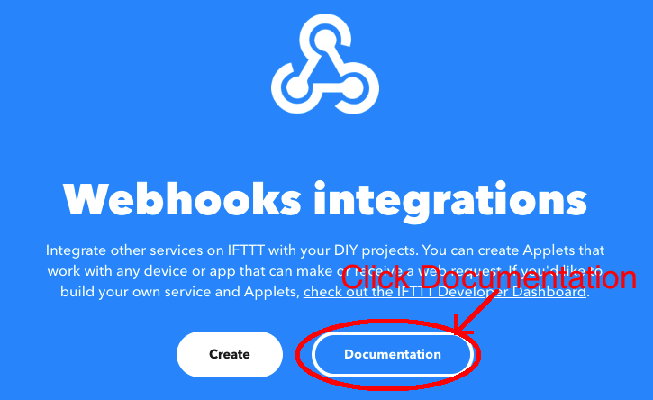
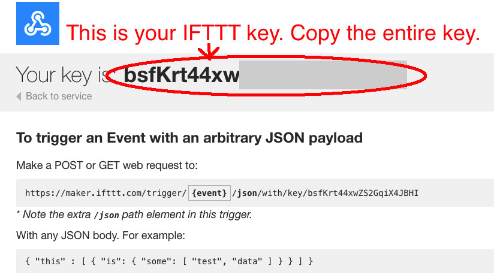
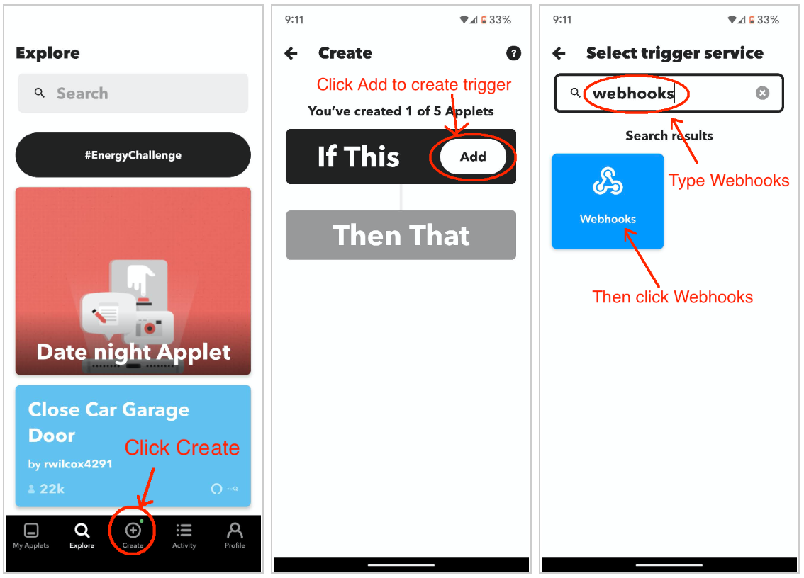
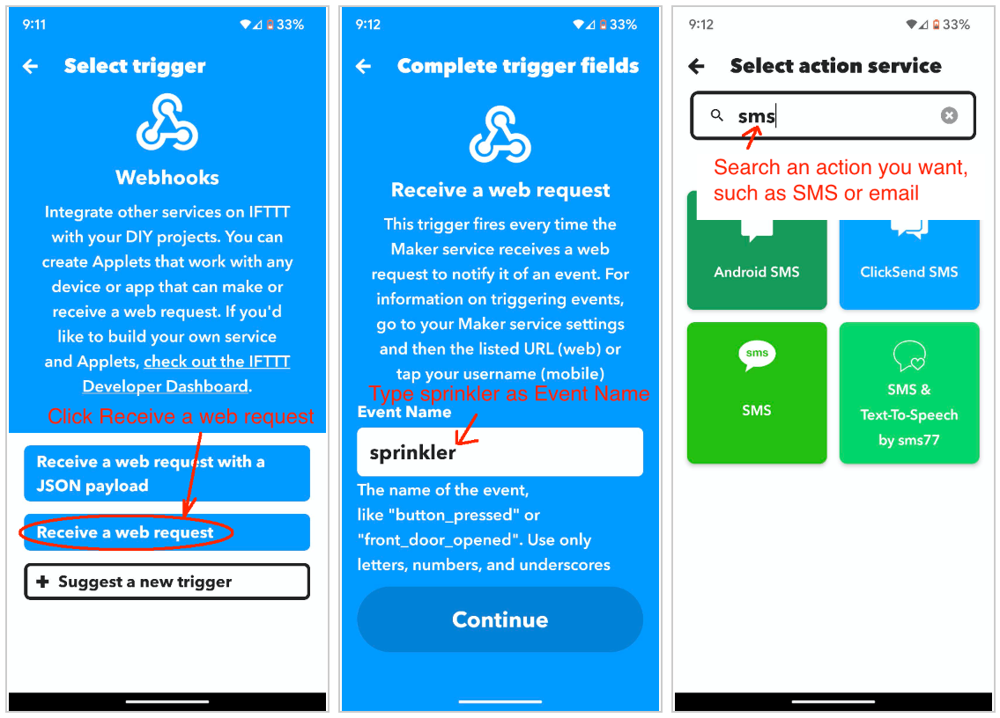

# Setting Up IFTTT Notifications

!!! note
    IFTTT now requires a paid subscription to use the Webhook trigger explained below. The advantage of IFTTT is that it supports multiple (SMS, email, and push) notifications. However, if you prefer a free service, [follow this support article to set up email notifications](./emailNotifications.md), **which costs nothing and does not require a subscription**.

## Step 1: Create an IFTTT Account and Obtain a Key

* Use the IFTTT mobile app (or visit [ifttt.com](https://ifttt.com)) and **log in** using an existing account or **sign up** for a new one.
* Click "**Explore**" and enter "**Webhooks**" in the search bar, then select if from the search results.

* Next, click on "**Documentation**". This will open a new page that displays **your IFTTT key**.

* Copy and paste this key to the OpenSprinkler's IFTTT key setting.

## Step 2: Create an IFTTT Applet

IFTTT allows you to connect a **trigger** (this) with an **action** (that). For example, if **Webhooks** is the trigger, then every time it receives an HTTP request from OpenSprinkler, it triggers an action, such as send an SMS text message to your phone, or send a push notification to your IFTTT mobile app. A pair of trigger and action is called an **Applet**.

Use either the IFTTT mobile app or log in to [ifttt.com](https://ifttt.com):

* Click **Create**. Then, for **trigger** (this), search and select **Webhooks**.

* Choose "**Receive a web request**. Then, enter `sprinkler` as the "Event Name" of the request. Click "**Create Trigger**" to complete the setup of the trigger and search for a preffered **action** (that).

* Select your desired notification method then delete the message body and insert **Value1** in the content. That is the variable that OpenSprinkler passes the notification message through. If you do not see Value1, click "**Add Ingredient**" and it should appear on the list for selection.

## Step 3: Select OpenSprinkler Events to Trigger IFTTT

The final step is to choose **which events will trigger IFTTT notifications** and configure a custom **Device Name** for easy identification. Go to **Edit Options --> Integrations**, click **Notification Events**, and you wil see a list of choices:

* **Program Start**: Triggered when a program starts.
* **Sensor 1 Update**: Triggered when Sensor 1 is enabled and its status changes.
* **Sensor 2 Update**: The same as above but for sensor 2.
* **Rain Delay Update**: Triggered when the rain delay status changes.
* **Flow Sensor Update**: Triggered upon the completition of a program if the flow sensor is enabled.
* **Weather Update**: Triggered when there is weather update (e.g. a change in water level) or when the external IP address changes.
* **Controller Reboot**: Triggered when the controller restarts.
* **Station Finish**: Triggered when a station (zone) completes its run.
!!! note
    This may generate a high number of notifications. Only enable it if necessary.
* **Station Start**: Triggered when a zone begins running.
!!! note
    This may generate a high number of notifications. Only enable it if necessary.
* **Flow Alert**: Triggered when a zone finishes running and the flow rate exceeds the set threshold.
* **Current Alert**: Triggered when undercurrent or overcurrent faults are detected. (Available from firmware 2.2.1(3))

!!! warning
    If your controller runs many zones daily, consider disabling certain events (e.g. **Station Start** and **Station Finish**) to prevent excessive notifications. Sending each notification takes time, so **too many notifications can cause delays, missed responses, and skipped short watering cycles**. Additionally, if you use **SMS** notifications, frequent event messages **may be blocked or filtered** by your SMS carrier.

Below **Notification Events**, you can enter a custom **Device Name**. This device name is included in all IFTTT notifications, making it easier to identify which controller sent the message. This is especially useful if you manage multiple OpenSprinkler devices.
