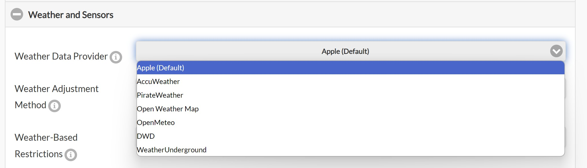
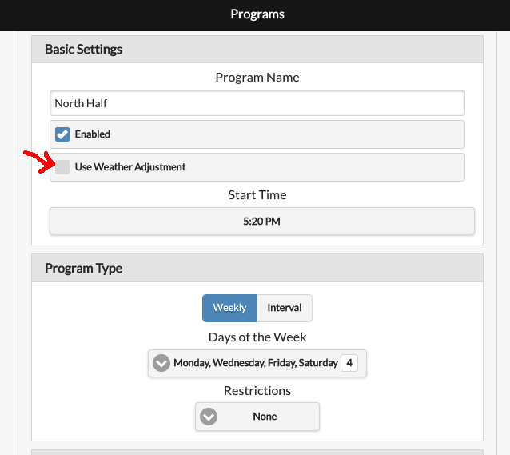
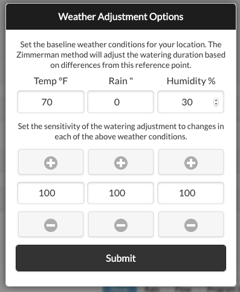

# Using Weather Adjustments

## Overview

OpenSprinkler can utilize online weather data to automatically make daily adjustments to the station water time. By default, it uses [Apple WeatherKit](https://developer.apple.com/weatherkit/) as the weather data provider, offering global coverage. Below we outline the available weather adjustment methods and provide a brief overview of their implementation details.

## Configuration

On the controller's homepage, go to **Edit Options --> Weather and Sensors**, where you can select an **Adjustment Method**, set **Weather Restrictions**, and choose a **Weather Data Provider**. Each adjustment method has a set of parameters, which it uses to determine how watering percentages are calculated.

### Selecting an Adjustment Method

* **Manual Adjustment (Default)**
  * Allows manual setting of the watering percentage (0-250%).
  * Programs with "**Use Weather Adjustment**" enabled will scale watering times based on the set percentage.
    * Example: If a program schedules 60 minutes for a zone and the watering percentage is set to 50%, the zone will water for 30 minutes.

* **Zimmerman**
  * Automatically adjusts the watering percentage based on **temperature**, **humidity**, and **precipiation**.
  * When selected, the % Watering input is disabled, as the percentage is calculated dynamically.
  * It is simple, intuitive, and great for general home irrigation.
  * Implementation details of the Zimmerman method and its parameters are explained below.

* **Auto Rain Delay**
  * Uses the current precipitation data to automatically set a rain delay.
  * **Does NOT modify watering percentage**. This will only trigger a rain delay when weather data indicates that it is raining.

* **ETo (Evapotranspiration)**
  * A more **advanced** method based on industry standards.
  * Utilizes additional weather parameters, such as the **geolocation**, **altitude**, **solar radiation**, and **yearly baseline ETo value** of your location.
  * **Requirements**:
    * You must provide a **Baseline ETo** (or click "**Detect Baseline ETo** to auto-detect using your location).
    * You must set your **Elevation** for accurate calculations.
  * Implementation details about ETo and its parameters are explained below.

* **Monthly Adjustment**
  * Similar to Manual mode, but allows setting a **fixed watering percentation per month**.
  * Useful for **seasonal watering schedules**.

### Using Multi-Day Average Watering Levels

Starting with **firmware 2.2.1(3)**, multi-day average watering levels can be used to adjust a program's run time. When the selected adjustment method is **Zimmerman** or **ETo**, a checkbox appears that enables this option for interval programs (programs that run on a fixed interval). For example, a program scheduled every 5 days will use the average watering levels from the past 5 days, rather than relying solely on yesterday's value. This provides more accurate adjustments for programs that do not run daily, accounting for all weather changes since the previous run.

This feature applies **only to interval programs** and will not affect other program types. When enabled, the array of multi-day watering levels is shown in the System Diagnostics. The array length depends on the selected weather provider. Apple supports up to 10 days while other providers may have less data. Refer to the historical weather data capability of each provider in the table below.

### Weather Restrictions

Starting with **firmware 2.2.1(3)**, the following weather restrictions can be enabled with any adjustment method:

* **Rain**: Skip watering if the **total forecast rain** exceeds a set amount over a user-defined number of days (e.g. 0.5 inches over the next 3 days). Setting either value to 0 will disable this rule.
  * **Note**: The forecast capability is limited by your selected weather provider. If the chosen number of days exceeds the amount provided from the weather service, the maximum number of days available will be used. See the table below for the historical capabilities of each provider.
* **Temperature**: Skip watering if the current temperature falls below a set value (e.g. 50&deg;F or 10&deg;C). A value of -40 (either &deg;F or &deg;C) disables this rule.
* **California Rule**: Legacy option that prevents watering if rainfall in the past 48 hours exceeds 0.1 inches.

If any weather restriction is activated, it is displayed both on the homepage and in the System Diagnostics.

### Selecting a Weather Data Provider

OpenSprinkler's weather service offers multiple weather provider options for flexibility and accuracy. The table below lists each provider along with its historical and forecast data capabilities.

| **Provider** | **Requires API Key?** | **Notes and Capabilities** |
| ------------ | --------------------- | -------------------------- |
| [Apple (Default)](https://developer.apple.com/weatherkit/) | No | Default option. Reccomended for general use. Historical: 10 days; Forecast: 10 days. |
| [AccuWeather](https://www.accuweather.com/) | Yes | Historical: 1 day; Forecast: 5 days. |
| [PirateWeather](https://pirateweather.net/en/latest/) | Yes | Open-source alternative to Dark Sky with similar API. Historical: 1 day; Forecast: 8 days. |
| [OpenWeatherMap](https://openweathermap.org/) | Yes | Historical: 1 day; Forecast: 8 days. |
| [Open-Meteo](https://open-meteo.com/) | No | Free and open-source. Historical: 7 days; Forecast: 7 days. |
| [DWD (Germany Only)](https://brightsky.dev/) | No | Only works for German locations. Historical: 7 days; Forecast: 7 days |
| [Weather Underground](https://www.wunderground.com/) | Yes | Requires the location to be a PWS station. Historical: 6 days; Forecast: 6 days. |

**Entering an API Key (if required):**

* If the provider requires an API key, an entry box labeled "**Weather API Key**" will appear.
* Enter your API key and click **Verify** to check its validity. If the key is confirmed as valid, submit to save your changes.

### Set a Program to Use Weather Adjustment

Each sprinkler program can be individually set to use weather adjustment. On the page to edit the program, there is a "**Use Weather Adjustment**" checkbox. By default this option is disabled, but when enabled the program's watering time will be automatically adjusted based on your current weather adjustment method and settings.

## Technical Details on Weather Adjustment Methods

### Zimmerman Method

The Zimmerman method calculates the watering percentage based on **temperature**, **humidity**, and **precipitation**. It uses a baseline reference, and any deviation from this baseline increases or decreases the watering percentage. The **default parameters** are:

* **Temperature**: 70&deg;F (21&deg;C)
* **Humidity**: 30%
* **Precipitation**: 0 inches

At these baseline values, the watering percentage remains 100% (i.e. no change to scheduled watering). The adjustment formula is:\
`Watering Percentage = 100 + (T - 70) * 4 + (30 - H) - 200 * (P - 0)`\
Where:

* **T** = Average temperature (&deg;F) from the previous day.
* **H** = Average humidity (%) from the previous day.
* **P** = Total precipitation (inches) from the previous day.

**Clamping Rule**: The final watering percentage is always limited between **0% and 200%**

**Example**: Say yesterday's conditions were: T=86&deg;F, H=68%, P=0.12 inches. Using the formula:\
`100 + (86 - 70) * 4 + (30 - 68) - 200 * (0.12) = 112%`\
This means the watering time will be adjusted to **112%** of the original scheduled time.

#### Customizing Baseline Parameters & Weights

Due to regional variations in weather data accuracy, you can fine-tune the **baseline** values in the Adjustment Method Options. Each factor is also assigned a **weight** paramter (0-100%) that alters its influence. This allows you to:

* Modify the baseline parameters if data consistently **under or overestimates** any of the T, H, or P values.
* Modify the weight of each factor (T, H, P) to **increase or decrease their influence**.

For example, if your weather data consistently over-estimates the humidity, you can increase the humidity baseline (**BH**) to counteract the innacuracy. If you want to reduce the influence of the humiidity, you can decrease its weight (**WH**). If you don't want precipitation to affect the calculation at all (e.g. due to watering indoors), set its weight (**WP**) to 0.

**The final formula** accounting for both baseline and weight adjustments is:\
`Watering Percentage = 100 + (T - BT) * 4 * WT + (30 - BH) * WH - 200 * (P - BP) * WP`\
Where:

* **BT, BH, BP** = Baseline values for temperature, humidity, and precipitation.
* **WT, WH, WP** = Weights for each factor.

### Evapotranspiration (ETo) Method

Evapotranspiration (ET) measures water loss from soil and plants due to evaporation and transpiration. The ETo adjustment method compares the reference ET index (ETo) and precipitation from the previous day againsst the baseline ETo for your location to calculate the watering percentage. Its formula is:\
`Watering Percentage = ((Yesterday's ETo - Yesterday's Precip) / Baseline ETo) * 100%`

**Clamping Rule**: The final watering percentage is always limited between **0% and 200%**.

The Baseline ETo represents the average ETo for your location. You can either click "**Detect Baseline ETo**" to auto-detect your baseline ETo, or manually enter it.

#### How is ETo different from Zimmerman?

* It is more advanced. It considers geolocation, altitude, and solar radiation in addition to temperature, humidity, and precipitation.
* It is based on the [FAO-56 Penman-Monteith](https://www.fao.org/4/X0490E/X0490E00.htm) equation (industry standard).

#### Precautions When Transitioning from Zimmerman to ETo

If you have previously used Zimmerman and choose to switch to ETo, you may notice **significant differences** in watering percentage calculations. This happens because ETo is a fundamentally different algorithm and accounts for more factors, leading to different results.

To adjust for this change, set your programmed watering times based on the yearly average instead of summer-only schedules. This way during hot seasons watering percentage will increase above 100%, while in cooler seasons it will drop below 100%.

#### Fine-Tune ET Calculations

The auto-detection of baseline ETo may not be accurate. If you find the ET method consistently **over or underestimates** watering, you can adjust the **Baseline ETo** value. Example: If the system overestimates watering by 20%, increase the baseline ETo by 20%. Specifically:

* If your baseline ETo was 0.112, increase it to 0.134 (20% increase)
* Since the formula divides by baseline ETo, this counteracts the overestimate and reduces the watering percentage accordingly.

#### Manually Calculating ETo

If you want to manually calculate an ETo value, follow these rules:

* Use the potential evapotranspiration (not the actual evapotranspiration)
* The ETo must be calculated using the FAO-56 Penman-Monteith method.
* The ETo should use data from the same time of year that the watering schedule was designed for. If you use the same watering schedule all year, use the annual ETo. Otherwise use the ETo for the season in which your schedule is used.
